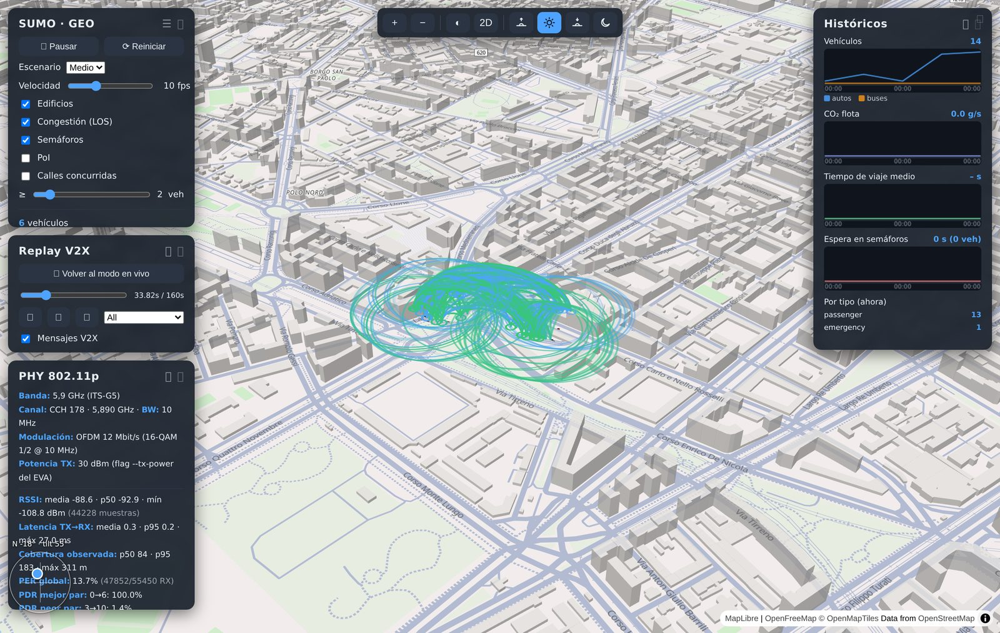

# van3twin-docker — VaN3Twin + visor 3D SUMO-GEO (integración V2X)

Stack Docker para ejecutar **VaN3Twin** (framework V2X sobre ns-3, ejemplo EVA
802.11p) con movilidad SUMO y visualizarlo **en vivo y en 3D en el navegador**
mediante **SUMO-GEO** (MapLibre/deck.gl), acoplados a la misma instancia de
SUMO por TraCI multi-cliente. Incluye además un modo **replay offline**: los
`.pcap` de una corrida se reproducen sobre el mapa con el intercambio de
mensajes real (CAM/CPM/DENM), disección ASN.1 por capas, distancia/RSSI por
enlace y estadísticas de capa física.

Desarrollado en la Universidad de Cuenca — Redes Vehiculares y Heterogéneas
(INGE-00104). Preparado para **PC Windows x86_64** (Docker Desktop + WSL2,
imagen **amd64** — la opción activa del compose); también corre en Linux y en
macOS (en Apple Silicon hay que cambiar una línea del compose, ver abajo).



*Replay de una corrida EVA 802.11p: arcos de recepción CAM/CPM sobre los
edificios 3D, panel **PHY 802.11p** (RSSI, latencia TX→RX, cobertura observada,
PER/PDR por par) y panel de **históricos** de la flota.*

## Los tres repositorios

| Repo | Contenido | Rol |
|---|---|---|
| **este** (`van3twin-docker`) | Dockerfile, `docker-compose.yml` unificado, manuales, práctica, contextos, herramientas | Punto de entrada: orquesta todo |
| [`Pbarbecho/VaN3TwinGEO`](https://github.com/Pbarbecho/VaN3TwinGEO) | Fork de VaN3Twin (ns-3) **con los parches de la integración** en `master` (TraCI multi-cliente `setOrder`, flag `--num-traci-clients`, log RSSI SignalInfo) | Código ns-3 |
| [`Pbarbecho/SUMO_GEO`](https://github.com/Pbarbecho/SUMO_GEO) | Visor web: backend FastAPI (modos managed/remote/**replay**) + frontend MapLibre/deck.gl | Código del visor |

## Contenido de este repo

```
docker-compose.yml      compose UNIFICADO: servicio van3twin + profile "visor"
                        (backend remote + frontend nginx del repo SUMO_GEO)
Dockerfile              imagen van3twin:jammy (ubuntu 22.04 multi-arch, SUMO 1.12,
                        gRPC, NetAnim, ns-3 compilado dentro)
Intergracion SUMO 3D WEB VAN3TWIN/
  Manual_Simulacion_VaN3Twin_SUMO_GEO.pdf   manual de operación completo
  Practica_Replay_V2X.pdf                   práctica: replay web vs Wireshark,
                                            teoría CAM/DENM/CPM/ASN.1/RSSI
  CONTEXTO_*.md                             estado técnico para retomar el trabajo
  img/, tools/                              capturas del visor y script que las genera
RESPALDO.md             plan de respaldo y réplica
results/                salidas de simulación (bind mount del contenedor)
```

## Ejecución en Windows

Windows es la plataforma por defecto de este stack (Docker Desktop ejecuta los
mismos contenedores Linux vía WSL2) y la opción de arquitectura del
`docker-compose.yml` ya viene **activa para PC x86_64**
(`platform: linux/amd64`) — en Windows no hay que cambiar nada del compose.
Pasos de preparación:

1. **Docker Desktop con WSL2**: activar el *WSL 2 based engine* y la
   integración con la distro Ubuntu (Settings → Resources → WSL integration).
   Asignar ≥4 CPUs y 12–16 GB de RAM (fichero `.wslconfig`).
2. **Trabajar siempre en la terminal de Ubuntu/WSL2** (no PowerShell) y clonar
   en el home de WSL (`~/`), **nunca** en `/mnt/c/...` (disco NTFS: E/S lenta y
   colisión de mayúsculas).
3. **Finales de línea**: antes de clonar,
   `git config --global core.autocrlf false` — evita que git inyecte `\r` en
   los scripts y el YAML, que se ejecutan dentro de contenedores Linux.
4. **Verificar la arquitectura**: `uname -m` en la terminal Ubuntu debe decir
   `x86_64` → la opción activa del compose (`linux/amd64`) es la correcta.
5. **Cliente VNC**: para la GUI de SUMO, en vez de `open vnc://127.0.0.1:5901`
   (macOS) usar un visor VNC de Windows (TightVNC, RealVNC) conectado a
   `127.0.0.1:5901`. El visor web es igual: `http://localhost:8081`.

Todo lo demás (build, comandos `docker compose`, uso del contenedor y de los
manuales) es idéntico en Windows, Linux y macOS.

### Si usas un Mac Apple Silicon (M1/M2/M3/M4)

Único cambio: en `docker-compose.yml`, comentar la línea activa
`platform: linux/amd64` y descomentar `platform: linux/arm64` (el propio
compose trae ambas líneas con instrucciones) **antes** de construir. Con la
arquitectura equivocada Docker emula con QEMU/Rosetta y el build de ns-3 se
multiplica varias veces o falla; cambiarla después obliga a reconstruir desde
cero. Para la GUI de SUMO en Mac: `open vnc://127.0.0.1:5901`.

## Replicar desde cero

1. **Clonar los repos** (⚠️ el fork de ns-3 **nunca** en filesystems
   *case-insensitive*: ni carpetas normales de macOS (APFS) **ni de Windows
   (NTFS)** — el repo tiene ficheros que solo difieren en mayúsculas
   (`ActionID/ActionId`, `BOOLEAN/boolean`) y colisionan al extraerse.
   Clonar/compilar solo en Linux, WSL2 (su ext4 interno, no `/mnt/c`) o, como
   hace este stack, dentro de un volumen Docker, que es case-sensitive):

   ```bash
   git clone https://github.com/Pbarbecho/van3twin-docker.git
   git clone https://github.com/Pbarbecho/SUMO_GEO.git
   ```

2. **Ajustar rutas del compose**: los servicios del visor referencian el repo
   `SUMO_GEO` con ruta absoluta (`build.context` del backend y los montajes del
   frontend). Editar esas tres rutas en `docker-compose.yml` para que apunten a
   donde se clonó `SUMO_GEO`.

3. **Imagen van3twin** — dos vías:

   **(a) Precompilada desde Docker Hub (sin compilar nada; la imagen
   publicada es arm64 — solo sirve en Mac Apple Silicon; en PC Windows/Linux
   x86_64 usar la vía (b)):**

   ```bash
   docker pull pbarbecho/van3twin:latest
   docker tag pbarbecho/van3twin:latest van3twin:jammy   # el compose la usa tal cual
   ```

   **(b) Construir desde el fork (1-3 h; incluye los parches, que están en
   master del fork):**

   ```bash
   cd van3twin-docker
   # PC Windows/Linux x86_64 (en Mac Apple Silicon: --platform linux/arm64)
   docker build --platform linux/amd64 \
     --build-arg VAN3TWIN_REPO=https://github.com/Pbarbecho/VaN3TwinGEO.git \
     -t van3twin:jammy .
   ```

4. **Levantar y probar**:

   ```bash
   docker compose --profile visor up -d       # van3twin + visor (:8081)
   docker compose exec van3twin bash
   ./ns3 run "v2v-emergencyVehicleAlert-80211p --sumo-gui=false --met-sup=true --sumo-updates=0.1 --num-traci-clients=2"
   # -> "waiting for 2 clients"; abrir http://localhost:8081 y arranca el lockstep
   ```

## Uso diario (resumen)

```bash
docker compose up -d                       # solo VaN3Twin (Modo A)
docker compose --profile visor up -d       # VaN3Twin + visor 3D (Modo B)
# replay de una corrida grabada:
docker compose exec van3twin bash -c 'cp ~/VaN3Twin/ns-3-dev/v2v-EVA-*.pcap ~/results/'
# -> botón "Replay pcap" en http://localhost:8081 (el backend detecta los ficheros solos)
```

El flujo completo (pasos A-B-C, modo paso a paso, panel PHY, RSSI real con
`signal-rx.csv`, solución de problemas) está en
`Intergracion SUMO 3D WEB VAN3TWIN/Manual_Simulacion_VaN3Twin_SUMO_GEO.pdf`;
el uso didáctico con Wireshark, en `Practica_Replay_V2X.pdf`.

## Licencias

VaN3Twin/ns-3: GPL-2.0 (upstream [DriveX-devs/VaN3Twin](https://github.com/DriveX-devs/VaN3Twin)).
SUMO-GEO y estos materiales: uso docente, Universidad de Cuenca.
