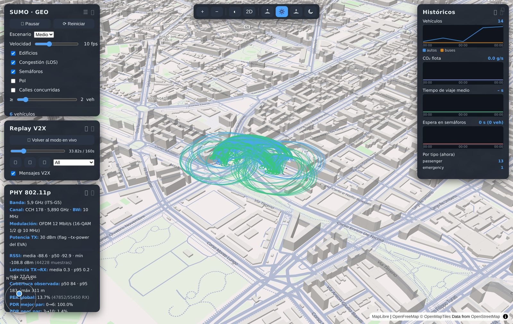

# van3twin-docker — VaN3Twin + visor 3D SUMO-GEO (integración V2X)

Stack Docker para ejecutar **VaN3Twin** (framework V2X sobre ns-3, ejemplo EVA
802.11p) con movilidad SUMO y visualizarlo **en vivo y en 3D en el navegador**
mediante **SUMO-GEO** (MapLibre/deck.gl), acoplados a la misma instancia de
SUMO por TraCI multi-cliente. Incluye además un modo **replay offline**: los
`.pcap` de una corrida se reproducen sobre el mapa con el intercambio de
mensajes real (CAM/CPM/DENM), disección ASN.1 por capas, distancia/RSSI por
enlace y estadísticas de capa física.

Desarrollado en la Universidad de Cuenca — Redes Vehiculares y Heterogéneas
(INGE-00104). Preparado para **PC Windows x86_64** (Docker Desktop + WSL2,
imagen **amd64** — la opción activa del compose); también corre en Linux y en
macOS (en Apple Silicon hay que cambiar una línea del compose, ver abajo).



*Replay de una corrida EVA 802.11p: arcos de recepción CAM/CPM sobre los
edificios 3D, panel **PHY 802.11p** (RSSI, latencia TX→RX, cobertura observada,
PER/PDR por par) y panel de **históricos** de la flota.*

## Los tres repositorios

| Repo | Contenido | Rol |
|---|---|---|
| **este** (`van3twin-docker`) | Dockerfile, `docker-compose.yml` unificado, manuales, práctica, contextos, herramientas | Punto de entrada: orquesta todo |
| [`Pbarbecho/VaN3TwinGEO`](https://github.com/Pbarbecho/VaN3TwinGEO) | Fork de VaN3Twin (ns-3) **con los parches de la integración** en `master` (TraCI multi-cliente `setOrder`, flag `--num-traci-clients`, log RSSI SignalInfo) | Código ns-3 |
| [`Pbarbecho/SUMO_GEO`](https://github.com/Pbarbecho/SUMO_GEO) | Visor web: backend FastAPI (modos managed/remote/**replay**) + frontend MapLibre/deck.gl | Código del visor |

## Contenido de este repo

```
docker-compose.yml      compose UNIFICADO: servicio van3twin + profile "visor"
                        (backend remote + frontend nginx del repo SUMO_GEO)
Dockerfile              imagen van3twin:jammy (ubuntu 22.04 multi-arch, SUMO 1.12,
                        gRPC, NetAnim, ns-3 compilado dentro)
Intergracion SUMO 3D WEB VAN3TWIN/
  Manual_Simulacion_VaN3Twin_SUMO_GEO.pdf   manual de operación completo
  Practica_Replay_V2X.pdf                   práctica: replay web vs Wireshark,
                                            teoría CAM/DENM/CPM/ASN.1/RSSI
  CONTEXTO_*.md                             estado técnico para retomar el trabajo
  img/, tools/                              capturas del visor y script que las genera
RESPALDO.md             plan de respaldo y réplica
results/                salidas de simulación (bind mount del contenedor)
```

## Ejecución en Windows

Windows es la plataforma por defecto de este stack (Docker Desktop ejecuta los
mismos contenedores Linux vía WSL2). El `docker-compose.yml` no fija
arquitectura: Docker construye para el procesador del equipo (x86_64 en PC,
arm64 en Mac Apple Silicon), así que no hay que editar nada. Pasos de
preparación:

1. **Docker Desktop con WSL2**: activar el *WSL 2 based engine* y la
   integración con la distro Ubuntu (Settings → Resources → WSL integration).
   Asignar ≥4 CPUs y 12–16 GB de RAM (fichero `.wslconfig`).
2. **Trabajar siempre en la terminal de Ubuntu/WSL2** (no PowerShell) y clonar
   en el home de WSL (`~/`), **nunca** en `/mnt/c/...` (disco NTFS: E/S lenta y
   colisión de mayúsculas).
3. **Finales de línea**: antes de clonar,
   `git config --global core.autocrlf false` — evita que git inyecte `\r` en
   los scripts y el YAML, que se ejecutan dentro de contenedores Linux.
4. **Verificar la arquitectura**: `uname -m` en la terminal Ubuntu debe decir
   `x86_64`; la imagen se construye para esa arquitectura automáticamente.
5. **Cliente VNC**: para la GUI de SUMO, en vez de `open vnc://127.0.0.1:5901`
   (macOS) usar un visor VNC de Windows (TightVNC, RealVNC) conectado a
   `127.0.0.1:5901`. El visor web es igual: `http://localhost:8081`.

Todo lo demás (build, comandos `docker compose`, uso del contenedor y de los
manuales) es idéntico en Windows, Linux y macOS.

### Si usas un Mac Apple Silicon (M1/M2/M3/M4)

No hay que cambiar nada: Docker construye la imagen para arm64 de forma
nativa (no fijar `platform: linux/amd64`, que obligaría a emular con Rosetta y
el build de ns-3 se multiplicaría varias veces o fallaría). Las imágenes del
visor en GHCR son multi-arquitectura. Para la GUI de SUMO en Mac:
`open vnc://127.0.0.1:5901`.

## Replicar desde cero

1. **Clonar los repos** (⚠️ el fork de ns-3 **nunca** en filesystems
   *case-insensitive*: ni carpetas normales de macOS (APFS) **ni de Windows
   (NTFS)** — el repo tiene ficheros que solo difieren en mayúsculas
   (`ActionID/ActionId`, `BOOLEAN/boolean`) y colisionan al extraerse.
   Clonar/compilar solo en Linux, WSL2 (su ext4 interno, no `/mnt/c`) o, como
   hace este stack, dentro de un volumen Docker, que es case-sensitive):

   ```bash
   git clone https://github.com/Pbarbecho/van3twin-docker.git
   git clone https://github.com/Pbarbecho/SUMO_GEO.git
   ```

2. **Ajustar rutas del compose**: los servicios del visor referencian el repo
   `SUMO_GEO` con ruta absoluta (`build.context` del backend y los montajes del
   frontend). Editar esas tres rutas en `docker-compose.yml` para que apunten a
   donde se clonó `SUMO_GEO`.

3. **Imagen van3twin** — dos vías:

   **(a) Precompilada desde Docker Hub (sin compilar nada; la imagen
   publicada es arm64 — solo sirve en Mac Apple Silicon; en PC Windows/Linux
   x86_64 usar la vía (b)):**

   ```bash
   docker pull pbarbecho/van3twin:latest
   docker tag pbarbecho/van3twin:latest van3twin:jammy   # el compose la usa tal cual
   ```

   **(b) Construir desde el fork (1-3 h; incluye los parches, que están en
   master del fork):**

   ```bash
   cd van3twin-docker
   # arquitectura nativa del equipo (amd64 en PC, arm64 en Mac Apple Silicon)
   docker build \
     --build-arg VAN3TWIN_REPO=https://github.com/Pbarbecho/VaN3TwinGEO.git \
     -t van3twin:jammy .
   ```

4. **Levantar y probar**:

   ```bash
   docker compose --profile visor pull backend frontend   # imágenes del visor (GHCR)
   docker compose --profile visor up -d       # van3twin + visor (:8081)
   docker compose exec van3twin bash
   ./ns3 run "v2v-emergencyVehicleAlert-80211p --sumo-gui=false --met-sup=true --sumo-updates=0.1 --num-traci-clients=2"
   # -> "waiting for 2 clients"; abrir http://localhost:8081 y arranca el lockstep
   ```

## Uso diario (resumen)

```bash
docker compose up -d                       # solo VaN3Twin (Modo A)
docker compose --profile visor up -d       # VaN3Twin + visor 3D (Modo B)
# replay de una corrida grabada:
docker compose exec van3twin bash -c 'cp ~/VaN3Twin/ns-3-dev/v2v-EVA-*.pcap ~/results/'
# -> botón "Replay pcap" en http://localhost:8081 (el backend detecta los ficheros solos)
```

El backend del visor mantiene **una única conexión TraCI** durante toda la
corrida (cliente 2 de SUMO): se puede recargar el navegador, abrir varias
pestañas o relanzar `./ns3 run` sin reiniciar los contenedores; el visor se
engancha solo y muestra «esperando a SUMO» mientras ns-3 no ha arrancado.
Play/pausa son globales (estado de la corrida, no de la pestaña) y, sin
ninguna pestaña abierta, la corrida queda en espera. Estado del enlace:
`curl localhost:8000/api/health`.

### Rendimiento y escalado (cientos de vehículos, mapas grandes) — 2026-09

Revisión completa del visor y del acoplamiento con ns-3 (cifras y detalle en
`docs/RENDIMIENTO_2026-09.md` del repo SUMO_GEO y `RENDIMIENTO_SUMO_GEO.md`
del fork VaN3TwinGEO):

* **Visor**: frame del backend 3× más rápido y 4-5× menos bytes por frame
  (protocolo v2), un visor lento ya no frena el *lockstep*, índice pcap en vivo
  incremental, vehículos glTF con atributos binarios, red vial en capas nativas
  de MapLibre (solo se dibujan los tiles visibles), **Modo ligero** en el panel
  (o `http://localhost:8081/?lite=1`) para portátiles con GPU integrada.
* **ns-3**: `TraciClient` lee el estado de la flota por **suscripción** (0
  round-trips por vehículo); el sensor SUMO y el `MetricSupervisor` dejan de
  ser O(N²) en llamadas TraCI. `--ns3::TraciClient::UseSubscriptions=false`
  restaura el comportamiento anterior. Con flotas grandes, `--pcap=false`
  desactiva los pcap por nodo (su volumen crece con N²; sin ellos no hay
  mensajes V2X en vivo ni replay).

Para actualizar una instalación existente (manual paso a paso para
alumnos: [`docs/ACTUALIZACION_2026-09.md`](docs/ACTUALIZACION_2026-09.md)):

```bash
git pull
docker compose --profile visor pull backend frontend               # visor nuevo (imágenes de GHCR)
docker compose --profile visor up -d
# parches ns-3 en un volumen ya poblado (el árbol ns-3 del volumen NO es un
# repo git: sandbox_builder.sh borra .git). Copia los 8 ficheros de
# ns3-patches/ al contenedor, guarda los originales y recompila (10-30 min):
./tools/apply-ns3-patches.sh
# deshacer: ./tools/revert-ns3-patches.sh
```

### Para los alumnos: cómo se actualiza el visor a partir de ahora

Las imágenes del visor (`backend` y `frontend`) ya vienen construidas en
GitHub Container Registry (`ghcr.io/pbarbecho/sumo-geo-backend` y
`sumo-geo-frontend`, para PC y Mac Apple Silicon): el repo SUMO_GEO las publica
automáticamente en cada cambio. Actualizar el visor es, sin compilar nada:

```bash
cd van3twin-docker
git pull
docker compose --profile visor pull backend frontend
docker compose --profile visor up -d
```

Comprobación: `curl localhost:8000/api/health` debe devolver `"proto":2`, y
`http://localhost:8081` se recarga con Ctrl+Shift+R (Cmd+Shift+R en Mac).

Para fijar una versión concreta por curso, el profesor crea un tag `vX.Y.Z`
en SUMO_GEO y los alumnos ponen `SUMO_GEO_TAG=vX.Y.Z` en el fichero `.env`
(plantilla en `.env.example`). Sin `.env` se usa siempre la última (`main`).
Construir las imágenes localmente sigue siendo posible con
`docker-compose.build.yml` (sin acceso a GHCR o con un fork propio).

**Mapa del visor.** Por defecto el visor dibuja el mapa del ejemplo EVA
(`sumo_files_v2v_map`). Si vas a usar el escenario de Cuenca, crea un fichero
`.env` en esta carpeta con

```bash
SUMO_GEO_NET=/replay/cuenca/cuenca.net.xml
SUMO_GEO_POLY=/replay/cuenca/cuenca.poly.xml
```

La segunda línea añade los edificios 3D, las zonas verdes, el agua, los
aparcamientos y los árboles del escenario (el EVA no trae polígonos, así que
en ese mapa solo se ven las veredas y las marcas viales).

y ejecuta `docker compose --profile visor up -d`: el backend se recrea en
segundos con el mapa nuevo (el resto de contenedores no se toca). Para volver
al EVA, borra la línea y repite el `up -d`.

### Escenario propio con realismo 3D: `build_city.sh`

El realismo del visor (edificios con altura real, veredas con bordillo, pasos
de cebra, zonas verdes, agua, aparcamientos y árboles) **no sale del mapa base
del navegador: el backend lo lee de los propios ficheros SUMO** del escenario
(`.net.xml` y `.poly.xml`). Por eso el flujo es siempre el mismo:
**1) generar los ficheros SUMO, 2) apuntar el visor a ellos**. El script
`scripts/build_city.sh` del repo SUMO_GEO genera esos ficheros **ya con la
información que el visor necesita**. Una red hecha a mano con `netconvert` o
con `osmWebWizard` corre igual en SUMO y en ns-3, pero el visor solo podrá
dibujar una vereda genérica, sin cruces ni árboles.

**1) Generar el escenario** (en tu PC/Mac, hace falta SUMO e internet):

```bash
git clone https://github.com/Pbarbecho/SUMO_GEO.git && cd SUMO_GEO
pip3 install eclipse-sumo sumolib
./scripts/build_city.sh "-79.010,-2.903,-79.000,-2.893" cuenca   # bbox = W,S,E,N
```

Pasos que hace y qué aporta cada uno al visor:

| Paso | Herramienta | Fichero (`sumo/`) | Qué dibuja el visor con él |
|---|---|---|---|
| 1 Descarga OSM | `osmGet.py` | `cuenca_bbox.osm.xml` (guárdalo) | nada directamente; lo usan los pasos 2-3 |
| 2 Red vial | `netconvert --tls.guess-signals --sidewalks.guess --crossings.guess` | `cuenca.net.xml` | calles, carriles, LOS, semáforos, **veredas reales** (carriles `allow="pedestrian"`) y **pasos de cebra** (`function="crossing"`) |
| 3 Polígonos | `polyconvert --osm.keep-full-type` + `enrich_heights.py` | `cuenca.poly.xml` | **edificios 3D** con altura real, **zonas verdes / agua / aparcamientos** por subtipo OSM y **árboles** (los mapeados `natural.tree` más un relleno dentro de parques y bosques) |
| 4 Demanda | `randomTrips.py` | `cuenca.rou.xml`, `cuenca.sumocfg` | demanda corta de prueba (600 s); sustituible por `gen_traffic.py` |

**2) Copiar y apuntar el visor.** Copia `cuenca.net.xml`, `cuenca.poly.xml`,
`cuenca.rou.xml` y `cuenca.sumocfg` a `results/cuenca/` de esta carpeta (se
monta en `/replay` para el visor y en `~/results` dentro del contenedor ns-3)
y pon en `.env`:

```bash
SUMO_GEO_NET=/replay/cuenca/cuenca.net.xml
SUMO_GEO_POLY=/replay/cuenca/cuenca.poly.xml
```

`docker compose --profile visor up -d` y comprueba con
`curl localhost:8000/api/meta`: debe mostrar conteos distintos de cero en
`landuse`, `trees`, `sidewalks` y `crossings`. Un cero ahí significa que el
fichero no trae ese dato, no que el visor falle.

**Ya tengo results/cuenca de antes y no veo veredas ni árboles.** Es el caso
habitual: la red se generó sin `--sidewalks.guess --crossings.guess` y los
polígonos sin `--osm.keep-full-type`. No hace falta volver a bajar nada ni
cambiar las rutas: estas dos órdenes funcionan **sin internet** y conservan
los ids de las aristas, así que los `.rou.xml` y la corrida de ns-3 siguen
valiendo (probado sobre la red de Cuenca: mismas 254 aristas antes y después;
se añaden 792 carriles de vereda, 214 cruces y 336 áreas peatonales):

```bash
cd results/cuenca
export SUMO_HOME=$(python3 -c "import os,sumo;print(os.path.dirname(sumo.__file__))")
export PATH="$SUMO_HOME/bin:$PATH"
# a) veredas y cruces sobre la red existente
netconvert -s cuenca.net.xml --sidewalks.guess --crossings.guess -o cuenca_ped.net.xml
mv cuenca_ped.net.xml cuenca.net.xml
# b) polígonos con subtipo OSM completo + alturas, a partir del map.osm guardado
polyconvert --osm-files map.osm --net-file cuenca.net.xml \
  --type-file "$SUMO_HOME/data/typemap/osmPolyconvert.typ.xml" \
  --osm.keep-full-type -o cuenca.poly.xml
python3 /ruta/a/SUMO_GEO/scripts/enrich_heights.py map.osm cuenca.poly.xml
docker compose --profile visor restart backend
```

Si no conservas el `map.osm`, vuelve a bajarlo con
`osmGet.py --bbox=W,S,E,N` usando el `origBoundary` que aparece en la línea
`<location>` del `.net.xml`.

**3) Correr el mismo escenario en ns-3.** El ejemplo acepta la carpeta y el
sumocfg por línea de órdenes, y `results/` está montado en el contenedor:

```bash
docker compose exec van3twin ./ns3 run "v2v-emergencyVehicleAlert-80211p \
  --sumo-folder=/home/vanet/results/cuenca/ --mob-trace=cuenca.rou.xml \
  --sumo-config=/home/vanet/results/cuenca/cuenca.sumocfg \
  --sumo-gui=false --met-sup=true --num-traci-clients=2"
```

La red que corre ns-3 y la que dibuja el visor deben ser **el mismo fichero**;
si mejoras la red con el paso anterior, hazlo antes de lanzar la simulación.

Estado del enlace y coste por frame: `curl localhost:8000/api/health`
(`sumo.frame_ms`, `sumo.dropped`).

El flujo completo (pasos A-B-C, modo paso a paso, panel PHY, RSSI real con
`signal-rx.csv`, solución de problemas) está en
`Intergracion SUMO 3D WEB VAN3TWIN/Manual_Simulacion_VaN3Twin_SUMO_GEO.pdf`;
el uso didáctico con Wireshark, en `Practica_Replay_V2X.pdf`.

## Licencias

VaN3Twin/ns-3: GPL-2.0 (upstream [DriveX-devs/VaN3Twin](https://github.com/DriveX-devs/VaN3Twin)).
SUMO-GEO y estos materiales: uso docente, Universidad de Cuenca.
